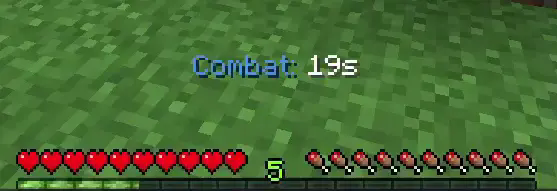

# CelestCombat-Xtra

[](https://github.com/ptthanh02/CelestCombat)
[](https://papermc.io/)
[](https://github.com/PaperMC/Folia)
[](https://discord.gg/WpYZkrdNVe)

A comprehensive combat management plugin for Minecraft servers specializing in PvP environments. Combat logging prevention, item restrictions, cooldowns, kill rewards, and more—all configurable.

---

## Where to Put Pictures (Recommended Placements)

For maximum impact, add screenshots or GIFs at these spots:

| Location | Suggested Image | Why |
|----------|-----------------|-----|
| **Right after the badges** (hero section) | Wide banner or collage of key features | First thing visitors see; sets the tone |
| **Combat Core section** | `assets/combattimer.png` – action bar / combat display | Shows the core mechanic in action |
| **Item & Cooldown section** | `assets/itemcooldowns.png` – pearl / trident cooldowns | Visual proof of cooldown display |
| **Newbie Protection section** | `assets/newplayerprotection.png` – boss bar | Demonstrates new player protection |
| **WorldGuard Integration section** | `assets/safezonebarrier.png` – barrier near PvP zones | Shows safe zone barriers in action |

**Format example:**
```markdown
### Combat Tagging

*Action bar shows remaining combat time and cooldowns*
```

---

## Requirements

- **Minecraft:** 1.21 – 1.21.4
- **Server:** Paper, Purpur, or Folia
- **Java:** 21+

### Optional Dependencies

| Plugin | Purpose |
|--------|---------|
| **PlaceholderAPI** | Placeholders for scoreboards, tab lists, holograms |
| **WorldGuard** | Safezone barriers and region protection |
| **GriefPrevention** | Claim-edge barriers and claim protection |

---

## Installation

1. Download the latest release (Modrinth / Spigot / Hangar links when available)
2. Place the `.jar` in your server’s `plugins` folder
3. Restart the server
4. Edit `plugins/CelestCombat/config.yml`
5. Reload with `/celestcombat reload` or `/ccx reload`

---

## Commands

| Command | Permission | Description |
|---------|------------|-------------|
| `/celestcombat` | `celestcombatxtra.command.use` | Main command (shows help) |
| `/celestcombat help` | `celestcombatxtra.command.use` | Display help |
| `/celestcombat reload` | `celestcombatxtra.command.use` | Reload config and messages |
| `/celestcombat tag <player1> [player2]` | `celestcombatxtra.command.use` | Manually tag players in combat |
| `/celestcombat removeTag <player\|world\|all>` | `celestcombatxtra.command.use` | Remove combat tags |
| `/celestcombat killReward clear [player]` | `celestcombatxtra.command.use` | Clear kill reward cooldowns |
| `/celestcombat newbieProtection add/remove/check <player>` | `celestcombatxtra.command.use` | Manage newbie protection |
| `/celestcombat config` | `celestcombatxtra.command.config` | Browse and edit config in-game |

**Aliases:** `/ccx`, `/celestcombat`, `/combat`

---

## Permissions

| Permission | Default | Description |
|------------|---------|-------------|
| `celestcombatxtra.command.use` | OP | Use all plugin commands |
| `celestcombatxtra.command.config` | OP | Browse and edit config in-game |
| `celestcombatxtra.update.notify` | OP | Receive update notifications |
| `celestcombatxtra.bypass.tag` | false | Bypass combat tagging (no combat-log punishment) |
| `celestcombatxtra.bypass.enchant_limit` | OP | Bypass enchant level limits |
| `celestcombatxtra.bypass.item_limit` | OP | Bypass item limiter (per-material caps) |
| `celestcombatxtra.bypass.spear_control` | OP | Bypass spear lunge cooldown and damage rules |

---

## Features

### Combat Core

- **Combat tagging** – Players are tagged for a configurable duration after PvP damage
- **Combat log punishment** – Disconnecting while tagged kills the player
- **Command blocking** – Blacklist or whitelist commands during combat (e.g. `/home`, `/tpa`)
- **Flight disable** – Stops creative flight while tagged
- **Nametag prefix/suffix** – Show opponent and time on scoreboard team
- **Boss bar** – Optional combat countdown boss bar (off by default)
- **Admin kick exempt** – No punishment when admins kick/ban

### Item & Ability Restrictions

- **Disabled items in combat** – Hard block for items like elytra
- **Cooldowned items** – Per-material cooldowns (chorus fruit, ice bomb, etc.)
- **Regearing block** – Block ender chest, shulker, bundle while tagged
- **Elytra abuse prevention** – Glide/firework block, strike counter, unequip/break/drop penalty
- **Mace cooldown** – Cooldown on mace hit, optional out-of-combat block
- **Wind charge cooldown** – Cooldown, combat-only toggle, refresh combat on throw
- **Ender pearl** – Cooldown, block in combat, per-world settings
- **Trident** – Cooldown, block in combat, banned worlds, per-world settings
- **Spear control (1.21+)** – Lunge cooldown, disable damage, disable all use
- **Harming arrows/potions** – Nullify damage, bow/crossbow/dispenser/potion toggles

### PvP Environment

- **Explosive controls** – Crystal, anchor, bed, TNT minecart placement/explosion
- **Enchant limiter** – Per-enchant max level (REVERT/DELETE/NONE)
- **Item limiter** – Per-material caps with per-world support
- **Death effects** – Lightning/fire particles on player death
- **Kill rewards** – Execute commands on kill with placeholders
- **Newbie protection** – Timed PvP/mob protection, boss bar/action bar
- **WorldGuard safezone** – Barrier blocks near no-PvP regions, chorus block
- **GriefPrevention claim** – Claim-edge barriers, permission-tier bypass

### Per-World Support

- **Item limiter** – Enable/disable per world via `item_limiter.worlds`
- **Enchant limiter** – Enable/disable per world via `enchant_limiter.worlds`
- **Ender pearl & trident** – Cooldown and banned worlds per world

---

## PlaceholderAPI

With PlaceholderAPI installed, the following placeholders are available:

| Placeholder | Description |
|-------------|-------------|
| `%celestcombat_in_combat%` | `true` or `false` |
| `%celestcombat_time_left%` | Remaining combat seconds |
| `%celestcombat_opponent%` | Opponent name |
| `%celestcombat_opponent_display%` | Opponent display name |
| `%celestcombat_pearl_cooldown%` | Pearl cooldown seconds |
| `%celestcombat_trident_cooldown%` | Trident cooldown seconds |
| `%celestcombat_wind_cooldown%` | Wind charge cooldown seconds |
| `%celestcombat_pearl_ready%` | `true` or `false` |
| `%celestcombat_trident_ready%` | `true` or `false` |
| `%celestcombat_wind_ready%` | `true` or `false` |

---

## Kill Reward Placeholders

Use these in `kill_rewards.commands`:

| Placeholder | Description |
|-------------|-------------|
| `%killer%` | Killer’s name |
| `%victim%` | Victim’s name |
| `%killer_uuid%` | Killer’s UUID |
| `%victim_uuid%` | Victim’s UUID |
| `%killer_health%` | Killer’s health when reward runs |
| `%victim_health%` | Victim’s health (usually 0) |
| `%killer_max_health%` | Killer’s max health |
| `%victim_max_health%` | Victim’s max health |
| `%world%` | Victim’s world name |
| `%x%`, `%y%`, `%z%` | Victim’s block coordinates |

---

## Configuration

Main config: `plugins/CelestCombat/config.yml`

Notable sections:

- `combat` – Duration, command blocking, nametag, boss bar
- `item_restrictions` – Disabled items, cooldowned items
- `elytra` – Elytra abuse prevention
- `item_limiter` – Per-material limits, per-world
- `enchant_limiter` – Enchant caps, per-world
- `enderpearl`, `trident`, `windcharge`, `mace`, `spear_control`
- `kill_rewards` – Commands and cooldowns
- `newbie_protection` – Duration, display, worlds
- `safezone_protection` – WorldGuard barriers
- `claim_protection` – GriefPrevention integration

Use `/celestcombat config` to browse and edit in-game (with permission).

---

## Building

```bash
git clone https://github.com/ptthanh02/CelestCombat.git
cd CelestCombat
./gradlew build
```

Output: `build/libs/`

---

## Discord

[](https://discord.gg/WpYZkrdNVe)

Join for support, updates, and feedback.

---

## Statistics

This plugin uses [bStats](https://bstats.org/) to collect anonymous usage statistics (server count, Minecraft version, etc.). This helps prioritize development. You can opt out in the bStats config.

---

## License

This project is licensed under the CC BY-NC-SA 4.0 License. See [LICENSE](LICENSE) for details.
