# CelestCombat-Xtra

**CelestCombat-Xtra** is a comprehensive combat management plugin for **SwordPvP, CrystalPvP, and competitive Minecraft servers**.

It prevents combat logging, blocks escape mechanics, integrates with major protection plugins, and provides advanced item restriction systems while remaining highly configurable for PvP balance.

---

# ⚔️ Combat System

* **Combat tagging** – Players who hit or get hit stay in combat for a set duration (e.g. 20 seconds).
* **Action bar timer** – Shows remaining combat time in blue text (e.g. *"Combat: 19s"*).
* **Command blocking** – Blacklist or whitelist commands during combat (e.g. block `/tpa`, `/home`).
* **Admin protection** – Staff kicks/bans don’t trigger combat-log penalties.
* **Flight control** – Disable creative flight while tagged.
* **Nametag & boss bar** – Optional opponent name and countdown.

---

# 📋 Action Bar Cooldowns

All timers appear in one line above the hotbar, separated by vertical bars.

* **Combat** – Blue countdown until you can leave combat.
* **Ender Pearl** – Red countdown before you can use pearls again.
* **Trident** – Light blue countdown for trident throws.
* **Wind Charge** – Light blue countdown for wind charges.
* **Mace** – Red countdown after mace hits.

Items on cooldown also show a **white wipe overlay** on the hotbar so you can see at a glance which items are ready.

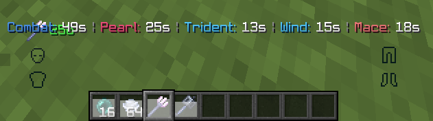

---

# 🚫 Configurable Item Blocking

## Disabled Items (in combat)

Add items to `disabled_items` in `config.yml`. While in combat, players **cannot use** these items at all.

**Example:** `SUSPICIOUS_STEW`, `ELYTRA`, custom items.

Players see a pink action bar message: *"You cannot use [item] while in combat!"*

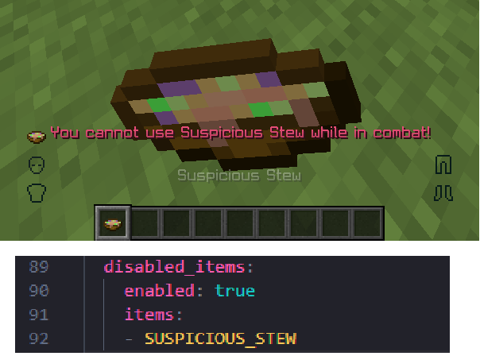

## Cooldowned Items

Add items with cooldowns in `cooldowned_items`. After use, the item is locked for a set time (e.g. 10 seconds for Chorus Fruit).

* Action bar shows the countdown (e.g. *"Chorus Fruit: 9s"*).
* Physical cooldown overlay on the item in the hotbar.
* Applies in combat and/or out of combat (configurable).

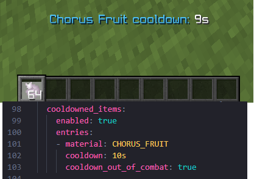

---

# 🛡️ Elytra Combat Rules

* **Block glide & fireworks** – No flying or firework boosting while in combat.
* **Strike counter** – After repeated tries (e.g. 2 strikes), the plugin acts:
  * **Unequip** – Elytra is moved to inventory.
  * **TEMP_BREAK** – If inventory is full, the elytra is broken for 30 seconds and then restored.
  * **DROP** – If inventory is full, the elytra is dropped at your feet.

Chat messages:
* *"You cannot use Elytra while in combat! (x2)"*
* *"Your elytra was unequipped after repeated use in combat."*
* *"Your inventory was full — your elytra was broken for 30s. Durability will return."*

A crossed-out elytra icon shows when elytra use is blocked.

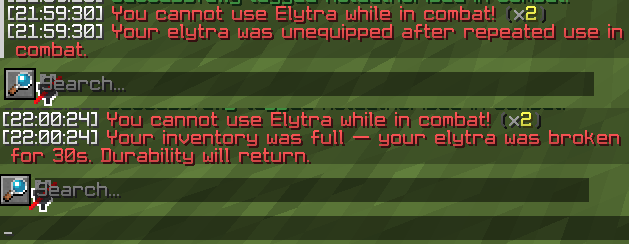

---

# 🔮 Ender Pearl & Trident

### Ender Pearl
* Cooldown with action bar timer.
* Optional block in combat.
* Per-world cooldown control.

### Trident
* Cooldown with action bar timer.
* Optional block in combat (throw & riptide).
* Per-world bans (e.g. no tridents in Nether).

---

# 💀 Harming Arrow Control

Controls Arrows of Harming from bows and crossbows.

* **Block shooting** – Set `bows_allow_harming` or `crossbows_allow_harming` to `false` to stop loading and firing harming arrows.
* **Block damage** – Set `no_damage: true` to cancel all harming arrow damage to players (arrows still fire but deal 0 damage).
* **Dispensers** – Optional block for dispensers.
* **Potions** – Optional block for harming potions (drink, throw, dispense).

Players see: *"Harming is disallowed on this server!"*

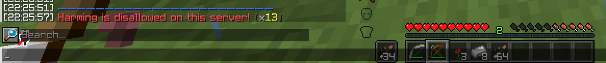

---

# 💥 Explosive Controls

Toggle prevention for:

| Item            | Message                               |
|-----------------|----------------------------------------|
| End Crystal     | *"End crystals are disabled here."*   |
| Respawn Anchor  | *"Respawn anchors are disabled here."*|
| Bed (Nether/End)| *"Beds are disabled in this dimension."* |
| TNT Minecart    | *"TNT minecart explosions are disabled."* |

All messages appear in pink on the action bar. Use `prevent_placement` / `prevent_use` / `prevent_explosion` in `config.yml`.

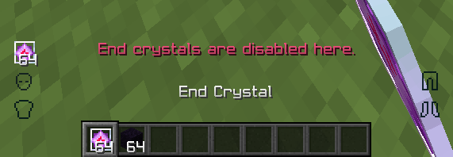  
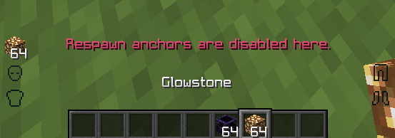  
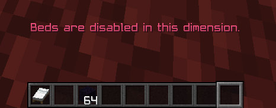  
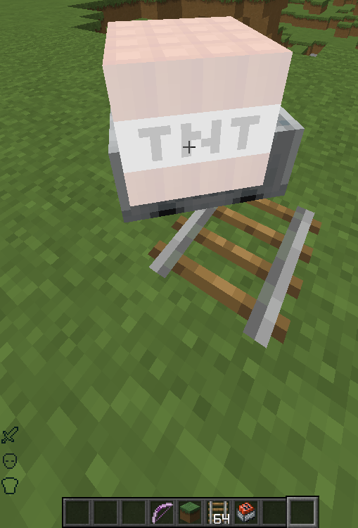

---

# ✨ Enchant Limiter

Stops overpowered enchants (e.g. Sharpness 255).

* **REVERT** – Clamp to max level (e.g. Sharpness V).
* **DELETE** – Remove the item.
* Per-world and bypass permission.
* Placeholders like Protection 4, Sharpness 5.

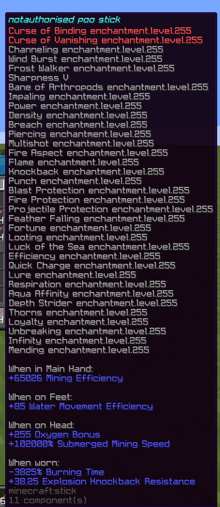

---

# 📦 Item Limiter

Limit how many of each material a player can hold (e.g. max 64 diamonds, 3 netherite ingots, 1 totem).

* Drop excess or remove.
* Per-world control.
* Action bar notice when denied.

---

# 🔒 Regearing Block (Combat)

While in combat:
* **Ender chest** – Blocked.
* **Shulker boxes** – Blocked.
* **Bundles** – Blocked.

Chat: *"You cannot access enderchests/shulkers/bundles while in combat!"*

---

# 🛡️ WorldGuard Safe Zone

Uses **WorldGuard** to stop players from escaping combat into no-PvP regions.

* **Red barrier** – Visual barrier at region borders.
* **Push-back** – Pushes players away from the barrier.
* **Chorus fruit** – Blocks teleporting into safe zones.
* Per-world settings.

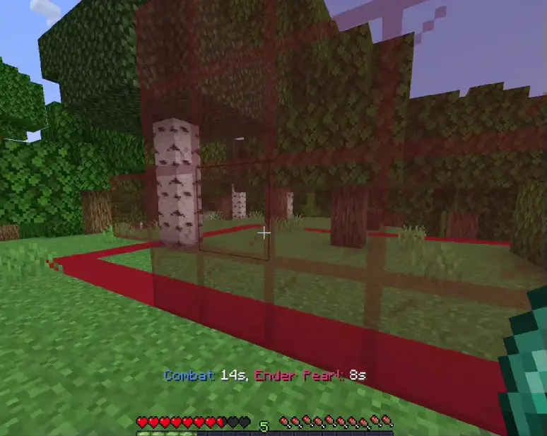

---

# 👶 New Player Protection

Protects new players for a configurable time (e.g. 10 minutes).

* **PvP protection** – Can’t be damaged by players.
* **Boss bar** – Green bar with *"PvP Protection: 8m 44s"*.
* **Removal** – Protection ends when they attack another player.
* Per-world settings.

---

# 🏆 Kill Rewards

Run commands when a player gets a kill.

* Placeholders: `%killer%`, `%victim%`, `%world%`, coordinates, health, etc.
* Global or per-victim cooldown.
* Example: `donutcratecore shards give %killer% 10`

---

# 🔌 Integrations

## PlaceholderAPI
* `%celestcombat_in_combat%`, `%celestcombat_time_left%`, `%celestcombat_opponent%`
* `%celestcombat_pearl_cooldown%`, `%celestcombat_trident_cooldown%`, `%celestcombat_wind_cooldown%`

## WorldGuard
* Safe-zone barriers and push-back.

## GriefPrevention
* Claim entry blocking during combat.

---

# ⚡ Per-World Control

Most features can be enabled or adjusted per world: item limiter, enchant limiter, ender pearl, trident, newbie protection.

---

# ⚡ Performance

* Single global countdown task.
* Client-side barrier rendering.
* Folia support.

Built for high-population PvP servers.
